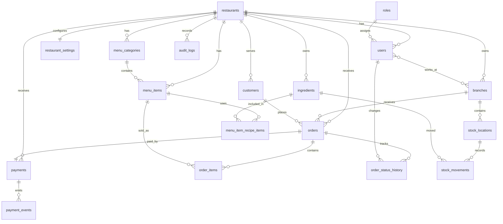

# Database ERD

This document is the working schema map for the modular monolith. It should be updated with every migration that changes product behavior.

## Mermaid ERD

## Core Tables

### `restaurants`

Platform tenant root.

Important columns:

- `id`
- `code`
- `name`
- `is_active`
- `created_at`

Rules:

- `code` is stable and unique across restaurants.
- Payment references use this code.

### `branches`

Physical or operational branch under a restaurant.

Important columns:

- `id`
- `restaurant_id`
- `code`
- `name`
- `location`
- `is_active`

Rules:

- `code` is stable and unique within a restaurant.
- Payment references use this code.

### `users`, `roles`, `user_branches`

Authentication, authorization, and branch assignment.

Rules:

- `ADMIN` users are platform scoped and do not need `restaurant_id`.
- Restaurant users must have `restaurant_id`.
- Cashiers and kitchen users should be assigned to one or more branches.

### `customers`

Restaurant-scoped customer profile and no-show counters.

Important columns:

- `restaurant_id`
- `phone_number`
- `total_orders`
- `completed_orders`
- `cancelled_orders`
- `uncollected_orders`

### `menu_categories`, `menu_items`

Restaurant-scoped menu configuration.

Rules:

- Sold-out or inactive items must not be orderable from cashier, QR, or WhatsApp channels.
- Price snapshots are copied onto `order_items` when the order is created.

### `orders`

Central operational record.

Important columns:

- `restaurant_id`
- `branch_id`
- `business_date`
- `daily_sequence`
- `display_number`
- `payment_reference`
- `customer_id`
- `channel`
- `subtotal`
- `total`
- `currency`
- `payment_status`
- `order_status`
- `created_by`
- status timestamps

Constraints:

- One `daily_sequence` per restaurant, branch, and business date.
- One `display_number` per restaurant, branch, and business date.

### `order_items`

Immutable sale line snapshots.

Important columns:

- `order_id`
- `menu_item_id`
- `quantity`
- `unit_price`
- `total_price`

### `order_status_history`

Audit-friendly order lifecycle log.

Important columns:

- `order_id`
- `sequence`
- `previous_status`
- `new_status`
- `changed_by`
- `changed_at`

Rules:

- Every backend-controlled order transition writes a history row.
- `sequence` is unique per order and provides deterministic lifecycle ordering.
- Kitchen changes should identify the acting user when authenticated.

### `payments`

One payment record per order in MVP.

Important columns:

- `order_id`
- `restaurant_id`
- `provider`
- `reference`
- `provider_transaction_id`
- `amount`
- `currency`
- `status`
- `completed_at`

Constraints:

- `reference` is globally unique.
- `(provider, provider_transaction_id)` is unique when a transaction ID is provided.

### `payment_events`

Raw or normalized payment callback history.

Rules:

- Store provider payloads for debugging and dispute resolution.
- Process provider event IDs idempotently.

### `audit_logs`

Money-sensitive and permission-sensitive event log.

Examples:

- Cash payment confirmed.
- Payment amount changed.
- Order cancelled.
- Settings changed.
- Menu item availability changed.

## Phase 2 Inventory Tables

Inventory tables are now active Phase 2 foundations. They remain ledger-based so stock
history can be audited and rebuilt from movements.

### `stock_locations`

Branch-specific stock storage locations, such as kitchen, freezer, or front counter.

Rules:

- Locations belong to one branch.
- Automatic order consumption uses the branch location named `Kitchen` when present.

### `ingredients`

Restaurant-owned stock items with units.

Examples:

- chicken portion
- potatoes kg
- takeaway box

### `menu_item_recipe_items`

Recipe link between menu items and ingredients.

Rules:

- Quantity is the amount consumed by one menu item.
- Recipe items must link menu items and ingredients from the same restaurant.

### `stock_movements`

Append-only inventory movement ledger.

Examples:

- purchase received
- wastage
- manual adjustment
- order consumption

Rules:

- Positive quantities add stock.
- Negative quantities remove stock.
- Manual movements write `audit_logs`.
- Order collection writes `ORDER_CONSUMPTION` movements when recipes exist.

## Schema Practices

- Prefer additive migrations after pilot data exists.
- Keep operational records tenant-scoped.
- Avoid deleting financial records; use statuses and audit logs.
- Store money as numeric decimal values.
- Store provider payloads, but never store customer payment credentials.
